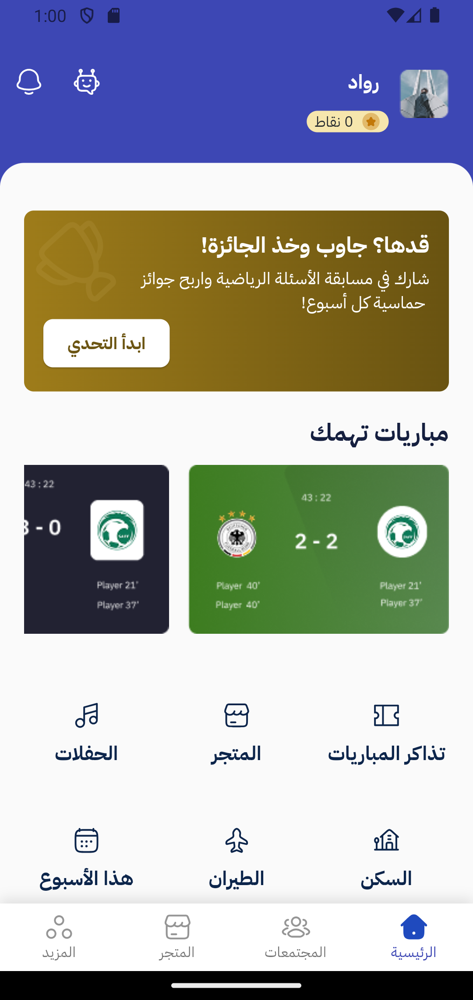
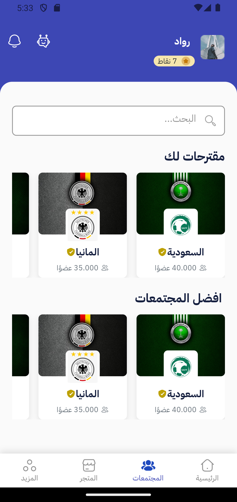
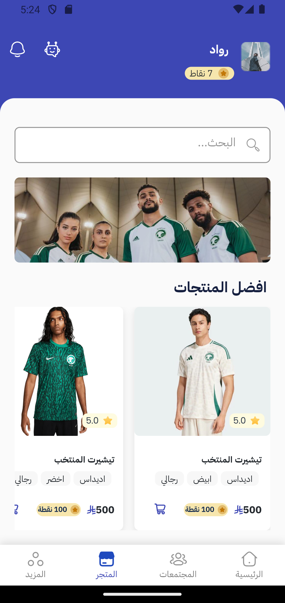

# 🟢 Yalla App | تطبيق يلا

تطبيق **يلا** هو منصة تفاعلية مخصصة لعشاق كرة القدم، تساعد المشجعين على متابعة أخبار منتخباتهم المفضلة، التفاعل مع مجتمعهم الرياضي، ومعرفة آخر الفعاليات وأماكن تجمع المشجعين، كل ذلك في تجربة ممتعة ومتكاملة.

## 📱 فكرة المشروع

يهدف تطبيق "يلا" إلى:

- تسهيل الوصول إلى **أخبار المنتخب المفضل**.
- إنشاء **مجتمعات تفاعلية** للمشجعين.
- توفير **متجر إلكتروني** خاص بالمشجعين.
- عرض **الفعاليات والمناسبات الرياضية**.
- تحديد **أماكن تجمعات المشجعين** في المدن.

## 🎯 المشكلة التي نحلها

يعاني المشجعون من تشتت المعلومات بين عدة منصات، وضعف التفاعل، وصعوبة معرفة الفعاليات أو أماكن تجمع المشجعين. "يلا" يجمع كل ذلك في تطبيق واحد.

## 🚀 المميزات

- 📰 أخبار حصرية للمنتخب
- 👥 مجتمعات تفاعلية للمشجعين
- 🛍️ متجر إلكتروني لمنتجات المنتخب
- 📍 خريطة بأماكن تجمع المشجعين
- 🎉 جدول الفعاليات والأنشطة

## 📈 فرص النمو
- دمج الذكاء الاصطناعي لتحليل اهتمامات المشجعين
- دعم البث المباشر ومحتوى حصري

## 📸 لقطات من التطبيق


### 🏠 الشاشة الرئيسية


### 📰 صفحة الأخبار


### 🛍️ صفحة المتجر



## 📦 طريقة التشغيل (Getting Started)

لتشغيل المشروع على جهازك المحلي:

1. **استنساخ المشروع:**

   ```bash
   git clone https://github.com/Rawadbs/yalla_app_hackthon.git
   cd yalla_app_hackthon
   ```

2. **تثبيت الحزم:**

   ```bash
   flutter pub get
   ```

3. **تشغيل التطبيق:**

   - شغّل محاكي (Emulator) أو وصّل جهاز حقيقي.
   - ثم نفّذ:

     ```bash
     flutter run
     ```

> تأكد من إعداد بيئة Flutter لديك مسبقًا. إذا لم تكن مثبتة، اتبع التعليمات من: [flutter.dev/docs/get-started/install](https://flutter.dev/docs/get-started/install)

---

> تم تطوير هذا المشروع ضمن هاكثون *(دوري سكاي للذكاء الاصطناعي)* بهدف تقديم تجربة رقمية متكاملة لعشاق كرة القدم في المملكة والعالم العربي.

